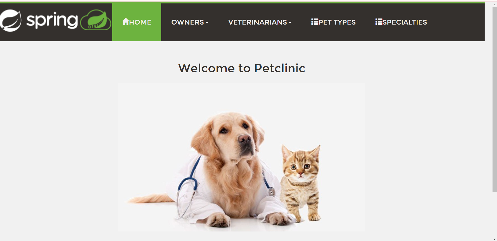
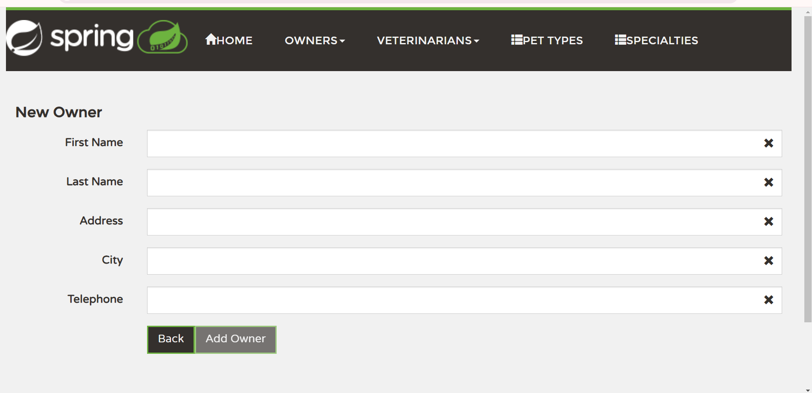
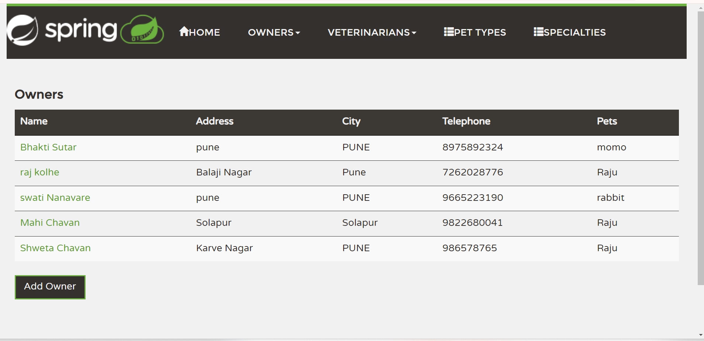
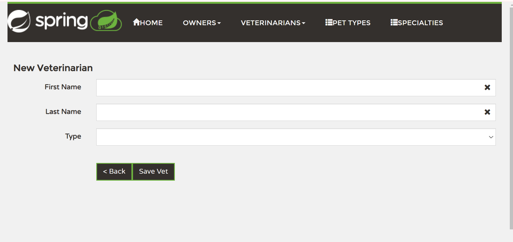
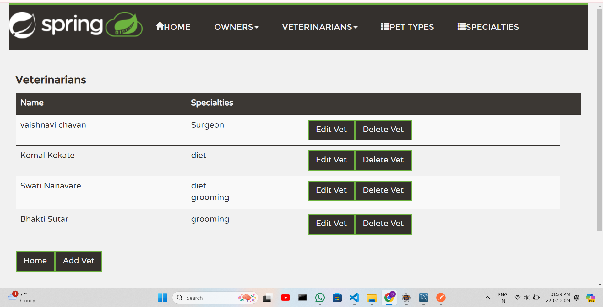
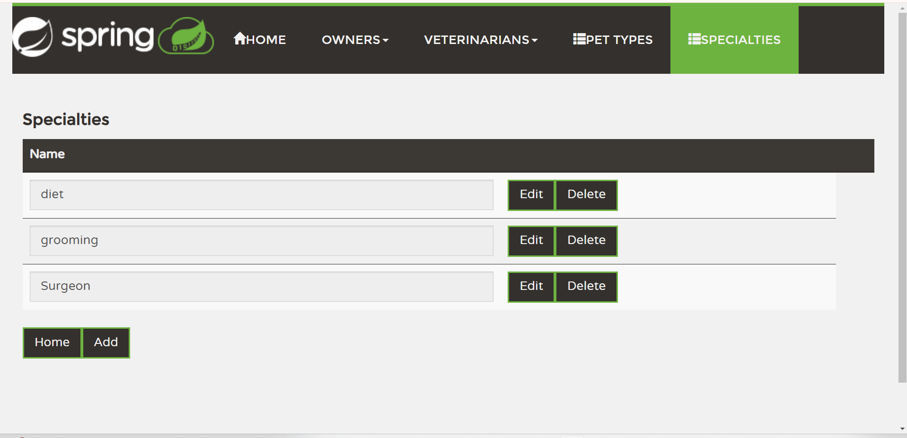
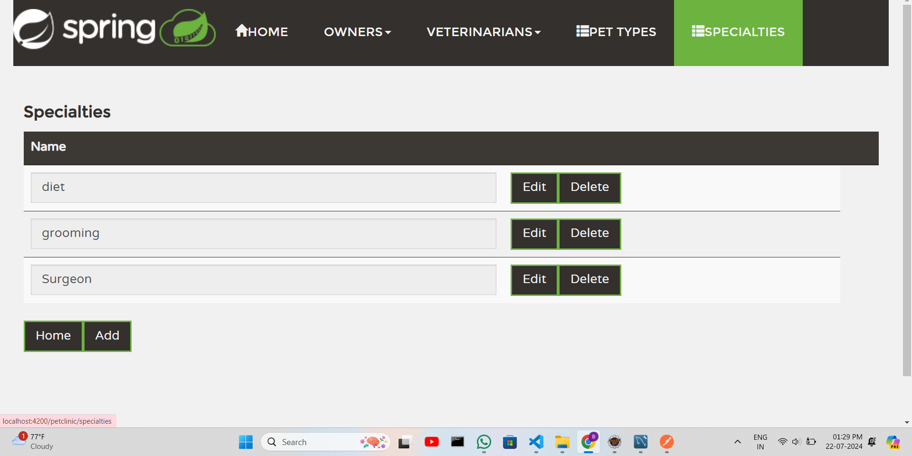
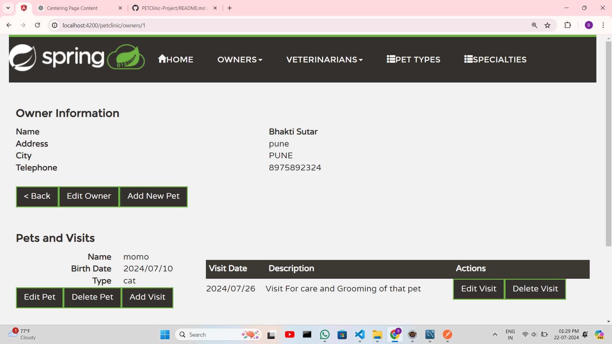

# PETClinic-Project
Welcome to the Petclinic project, a comprehensive example of a Spring Boot application combined with Angular for the frontend.

## Table of Contents
- [Installation](#installation)
- [Running the Application](#running-the-application)

## Installation

### Frontend (Angular) 

1. Update `angular-cli` to the latest version (8.0.3 current):
    ```bash
    npm uninstall -g angular-cli @angular/cli
    npm cache clean --force
    npm install -g @angular/cli@latest
    ```

2. Clone the project from GitHub:
    ```bash
    git clone https://github.com/spring-petclinic/spring-petclinic-angular.git
    cd spring-petclinic-angular
    ```

3. Install local project packages:
    ```bash
    npm install --save-dev @angular/cli@latest
    ```

4. If using npm version > 5.0, delete `package-lock.json` file:
    ```bash
    rm package-lock.json
    ```

5. Install project dependencies:
    ```bash
    npm install
    ```

### Backend (Spring Boot)

1. Clone the backend project from GitHub:
    ```bash
    git clone https://github.com/spring-petclinic/spring-petclinic-rest.git
    cd spring-petclinic-rest
    ```

2. Update the `application.properties` file to use MySQL. Change:
    ```properties
    spring.profiles.active=hsqldb,spring-data-jpa
    ```
    to:
    ```properties
    spring.profiles.active=mysql,spring-data-jpa
    ```

3. Check the properties defined in `application-mysql.properties`:
    ```properties
    spring.datasource.url=jdbc:mysql://localhost/petclinic
    spring.datasource.username=root
    spring.datasource.password=Bhakti@2004
    spring.datasource.driver-class-name=com.mysql.cj.jdbc.Driver


    spring.jpa.database=MYSQL
    spring.jpa.database-platform=org.hibernate.dialect.MySQL5Dialect
    spring.jpa.hibernate.ddl-auto=update
    spring.jpa.show-sql=true
    server.port = 9090
    ```

4. Ensure MySQL is running and create the `petclinic` database if it does not exist:
    ```sql
    CREATE DATABASE petclinic;
    ```

## Running the Application

### Frontend

1. Navigate to the Angular project directory:
    ```bash
    cd spring-petclinic-angular
    ```

2. Run the development server:
    ```bash
    ng serve
    ```

3. Open your browser and navigate to `http://localhost:4200/`.

### Backend

1. Navigate to the Spring Boot project directory:
    ```bash
    cd spring-petclinic-rest
    ```

2. Run the Spring Boot application:
    ```bash
    ./mvnw spring-boot:run
    ```

3. The backend server will start on `http://localhost:9090/`.
4. <h1>SCREENSHORTS</h1>
<h3>Home</h3>
<b>Description :</b><p align="justify">This is my Home Page </p>
</img><br>

<h3>ADD Owner</h3>
<b>Description :</b><p align="justify">This is Onwer Page </p>
</img><br>

<h3>Owner List</h3>
<b>Description :</b><p align="justify">This is Onwer List </p>
</img><br>

<h3>ADD Veternaries</h3>
<b>Description :</b><p align="justify"> Veterneries </p>
</img><br>

<h3>Veterinaries</h3>
<b>Description :</b><p align="justify">This is Veterinaries List </p>
</img><br>

<h3>Specalist</h3>
<b>Description :</b><p align="justify">Add new Specalist </p>
</img><br>


<h3>Pet Type</h3>
<b>Description :</b><p align="justify">From here you add new pets</p>
</img><br>

<h3>Final</h3>
<b>Description :</b><p align="justify"> this Is my final output when i add all information of pet, owner and vet</p>
</img><br>


